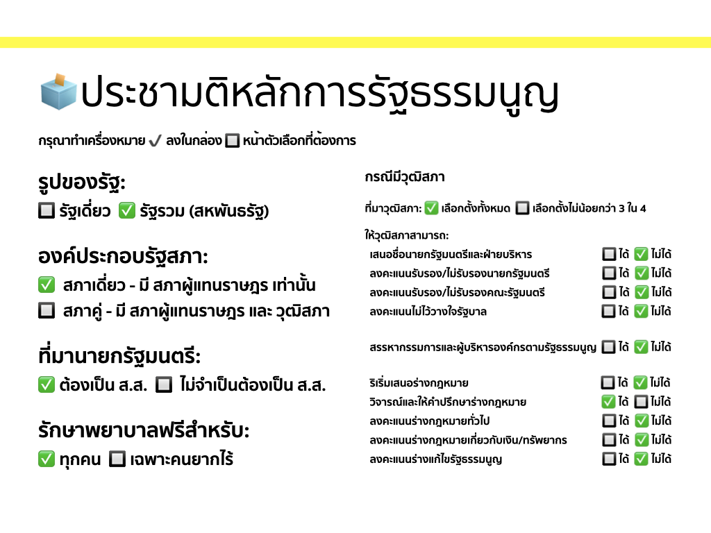
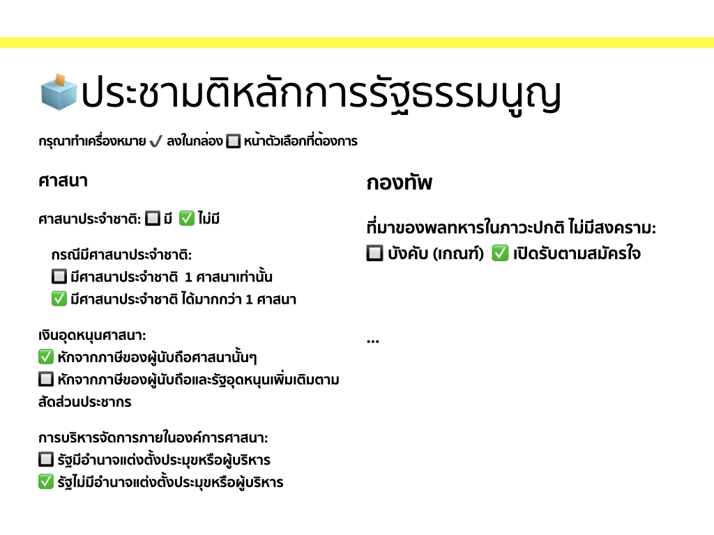

ประชามติรัฐธรรมนูญเราทำทำนองนี้ได้ไหม แบ่งเป็น 2 ขั้น

- ประชามติขั้นแรก (ประชามติหลักการ) ถามคำถามเชิงหลักการ ที่ต้องการเห็นในร่างรัฐธรรมนูญ

- ประชามติขั้นสอง (ประชามติตัวร่าง) ถามว่าจะ รับรอง หรือ ไม่รับรอง ร่างรัฐธรรมนูญที่คณะผู้ร่างนำเสนอ

คำถามในสองขั้นทั้งหมดเป็นคำถามไปสู่ตัวเลือกคำตอบแบบเลือก 1 จาก 2 (binary) ใช่-ไม่ใช่ รับ-ไม่รับ

--

--

หน้าที่ของสสร.คือเค้นหลักการต่างๆ ออกมา อะไรที่เป็นประเด็นที่ควรให้ประชาชนตัดสินใจแบบทางตรง แล้วสร้างคำถามที่จะถามในประชามติขั้นแรก

จากนั้นคณะผู้ร่างก็จะนำหลักการไปร่างรัฐธรรมนูญออกมา นำเสนอกับสสร. ชี้แจงว่า มาตราต่างๆ ที่เขียนนั้น มาจากหลักการและผลลัพธ์ใดจากประชามติ

สสร.ก็อภิปราย ซักถามกับคณะผู้ร่างไป ตรวจสอบว่าคณะผู้ร่างได้ร่างตามหลักการตามผลประชามติขั้นแรก แก้ไขจนมันเป็นไปตามนั้นให้มากที่สุด ไม่ต้องลงคะแนนอะไร แต่ควรช่วยอภิปรายชี้ประเด็นให้ประชาชนได้เห็นและนำไปคิดต่อเองได้

จากนั้นก็ทำประชามติขั้นสอง ให้ประชาชนตัดสินใจว่าจะรับหรือไม่รับร่างดังกล่าว

ถ้ารับ ก็ประกาศใช้ (และห้ามไปแก้ไขอะไรในเชิงเนื้อหากลางทางอีก แบบที่เกิดกับ รธน. 60)

ไม่รับ ก็ร่างใหม่ โดยใช้หลักการที่ได้รับการเลือกจากประชามติขั้นแรกในการร่างเหมือนเดิม ทำวนไป

--

ทั้งนี้เพื่อไม่ให้การร่างมันติดลูป วนไม่สิ้นสุด ก็กำหนดไปว่า ถ้าผ่านมาแล้ว x ร่าง (สมมติ 3 ร่าง) แล้วยังไม่มีร่างไหนได้รับรับรอง ก็ให้เลือกเอาร่างที่ได้รับคะแนนประชามติสูงที่สุด

สมมติว่าคะแนนที่จะผ่านประชามติขั้นสองแบบผ่านโดยทันที อยู่ที่ 2 ใน 3 (66.66%)
สมมติร่างแรกได้คะแนนรับรอง 40% ไม่ผ่าน
ร่างใหม่ ร่างสองได้คะแนนรับรอง 62% ไม่ผ่านอีก
ร่างใหม่ ร่างสามได้คะแนนรับรอง 60% ไม่ผ่านอีก

แบบนี้ก็ให้ร่างสอง (62%) ชนะไป ได้ไหม

หรือจะเลือกเอา 2 ร่างที่ได้คะแนนสูงที่สุด 2 อันดับแรก มาให้เลือกลงคะแนนในประชามติครั้งสุดท้ายก็ได้ (ที่ต้องเป็น 2 ร่าง ก็เพื่อให้คำถามเป็นคำถามแบบเลือก 1 จาก 2 ทำนองเดียวกับคำถาม ใช่-ไม่ใช่ เอา-ไม่เอา)

ถ้าตามตัวอย่างสมมติ ก็เอาร่างสอง (62%) กับร่างสาม (60%) มาให้คนเลือกลงคะแนนอีกที

ทั้งหมดนี้ตั้งอยู่บนสมมติฐานที่ว่า ไม่ว่าจะร่างไหน อย่างน้อยคณะผู้ร่างก็ได้ร่างตามเจตจำนงค์ของประชาชนที่แสดงออกมาตามประชามติขั้นแรกแล้ว คือไม่ว่าจะร่างหนึ่ง สอง หรือสาม ต่างก็เป็นร่างที่สะท้อนหลักการตามประชามติขั้นแรก ไม่ว่าในประชามติขั้นสองจะได้ผลลัพธ์เป็นอย่างไร ร่างที่ชนะก็เป็นร่างที่ไม่ขัดกับหลักการของประชามติขั้นแรก

(และการแก้ไขรัฐธรรมนูญใดๆ โดยสภาหลังจากนี้นับไป X ปี ก็ให้ยึดหลักการตามประชามติขั้นแรก ส่วนหลัง X ปีถ้าจะมีการเปลี่ยนแปลง ก็ให้ทำประชามติใหม่ ระหว่างที่ยังไม่มีประชามติขั้นแรกรอบใหม่ ก็ใช้ผลจากครั้งล่าสุดไปก่อน)

--

การย่อยประเด็นให้เล็กลง ตัดสินใจเป็นรายประเด็น ไม่ใช่มัดรวมทั้งฉบับที่มีประเด็นเยอะมาก
บวกกับใช้ภาษาในรูปแบบคำถาม ใช่-ไม่ใช่ ได้-ไม่ได้ เอา-ไม่เอา แทนที่จะเป็นภาษากฎหมายซับซ้อนหรือต้องอ่านประกอบหลายจุดมาเชื่อมโยงกัน
ก็น่าจะช่วยให้ประชาชนตัดสินใจได้ถูกต้องตรงกับความต้องการของตัวเองมากขึ้นด้วย

--

https://www.facebook.com/arthit/posts/10157386052701086
